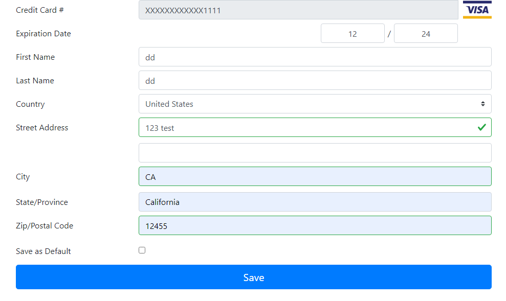

# Wallet Management

PayFabric Hosted Wallet pages are used for embedding the wallet page into your application to allow your users to create or update their card / eCheck details (including billing address information).

Refer to our [Wallet APIs](//https://github.com/PayFabric/APIs/blob/master/PayFabric/README.md#wallets--credit-cards--echecks) for full list of supported scenarios.

## Hosted Wallet Page Feature Comparison

Depending on business and integration requirements, PayFabric Hosted Wallet Page can be embedded in multiple ways.

|Feature       | Responsive Hosted | Hosted |
|--------------| --------------|------------|
|Mobile Responsive| Supported  | Require custom CSS/JS     |
|Single Page UI Framework Support (React, Vue, etc.)| Seamless Integration | Requires Reloading Page| 
|Callback Support| Full Support| -----
|Customizability| CSS/JS| CSS/JS| 

## Responsive Hosted Wallet Page 

Below are the steps on how to embed Responsive Hosted Wallet page using PayFabric JavaScript SDK library:
 
1. [Generate](../Sections/JWTToken.md#generate-token-for-a-wallet-process) JSON Web Token (JWT) 
2. [Load](../JavaScript%20SDK/JavaScript-SDK.md) PayFabric JavaScript SDK library using the generated JWT.

Alternatively, Responsive Hosted Wallet page can be embedded through direct iFrame call. Refer to below:

* Set intent to 'ResponsiveCreate' or 'ResponsiveEdit'.
* Set token to the generated JWT.

Format: ``{baseUrl}/payment/web/wallet/{intent}?token={token}``

Example: ``https://sandbox.payfabric.com/payment/web/wallet/ResponsiveCreate?token={token}``

### Responsive Hosted Wallet Page (iFrame) Optional Parameters

PayFabric Responsive Hosted Wallet page accepts the query string parameters below. Separate each parameter with ampersand ('&') to for the query string and add the query string to the Hosted Wallet page URL.

>
| QueryString| Description | 
| :------------- | :------------- | 
|Country=&Street1=&Street2=&Street3= &City=&State=&Zip=&Email=&Phone= |This query string can pass initial billing address information|
|ThemeName|This parameter is to support 3rd party dynamically passing into the theme name via query string. If the value is an existing theme name, then page will use this theme; If the value is a nonexistent theme name, then the page will use the device default theme.|
|UseBluefin|This parameter will take affect when [BlueFin Profile](https://github.com/PayFabric/Portal/blob/master/PayFabric/Sections/Bluefin.md) get enabled. When the value is '0', only regular keyboard entry for the credit card is available, when the value is `1`, only encryption key entry via Bluefin device for the credit card is available, when the value is `2`, both regular keyboard & encryption key entry for the credit card is available.|
|TrxInitiation|	This parameter specifies the wallet creation/updating initiated by the Merchant or Customer.|
|AcceptTender|This query string specifies the wallet tender when opening the responsive hosted create wallet page. Available values are 'CreditCard' and 'ECheck'.|

## Hosted Wallet Page

PayFabric Hosted Wallet page is used for embedding the wallet page into your application to allow your users to create or update their credit card / eCheck details (including billing address information).

There are two Hosted Wallet pages, create and edit. Before embedding the desired wallet page, please ensure the following:

- Create a Credit Card / eCheck
  
  - Generate a [Security Token](/Sections/Security%20Token.md).  Assume the token value is @TOKEN. 
  - Build the Hosted Create Wallet page URL this way:

    https://sandbox.payfabric.com/Payment/Web/Wallet/Create?customer={CUSTOMER_NUMBER}&tender={TENDER}&token={@TOKEN}  

    {CUSTOMER_NUMBER} = Your customers unique identifier  
    {TENDER} = *CreditCard* or *ECheck*

- Edit a Credit Card / eCheck

  -  Generate a [Security Token](/Sections/Security%20Token.md).  Assume the token value is @TOKEN. 
  -  Retrieve the unique card Id, see our [API documentation](../../../../PayFabric-APIs/blob/master/PayFabric/Sections/Wallets.md#retrieve-credit-cards--echecks) for how.  Assume the card Id is @CARDID.
  -  Build the Hosted Edit Wallet page URL this way:
  
     https://sandbox.payfabric.com/Payment/Web/Wallet/edit?card={@CARDID}&token={@TOKEN}

### Hosted Wallet Page Optional Parameters

PayFabric Hosted Wallet page accepts the query string parameters below. Separate each parameter with ampersand ('&') to for the query string and add the query string to the hosted wallet page URL.

>
| QueryString| Description | 
| :------------- | :------------- | 
|Country=&Street1=&Street2=&Street3= &City=&State=&Zip=&Email=&Phone= |This query string can pass initial billing address information|
|ThemeName|This parameter is to support 3rd party dynamically passing into the theme name via query string. If the value is an existing theme name, then page will use this theme; If the value is a nonexistent theme name, then the page will use the device default theme.|
|ReturnURI|When a valid URL is provided in ReturnURI, after the wallet record is saved, the hosted wallet page will redirect the user to the URL specified with the unique Wallet ID appended to the URL.  Note: This parameter is only supported with the create wallet operation.|
|isusenewtheme|	When the value is `1`, PayFabric's hosted page URL will trigger the V3 layout instead of the V2 Layout. The default value is `0`. **Note:** This query string only works for the non-responsive hosted create/edit wallet pages.|
|UseBluefin|This parameter will take affect when [BlueFin Profile](https://github.com/PayFabric/Portal/blob/master/PayFabric/Sections/Bluefin.md) get enabled. When the value is '0', only regular keyboard entry for the credit card is available, when the value is `1`, only encryption key entry via Bluefin device for the credit card is available, when the value is `2`, both regular keyboard & encryption key entry for the credit card is available.|
|TrxInitiation|	This parameter specifies the wallet creation/updating initiated by the Merchant or Customer.|

## Hosted Wallet Page 3D Secure Support

To enable the 3D Secure validation on Hosted Create Wallet page, [Credit Card Validation](https://github.com/PayFabric/Portal/blob/master/PayFabric/Sections/PayFabric%20Settings.md#transaction-options) setting must be enabled and the validation gateway must be EVO with eService processor.

<b>Note:</b> Hosted Create Wallet page only supports 3D Secure 2.0, doesn't support 3D Secure 1.0.